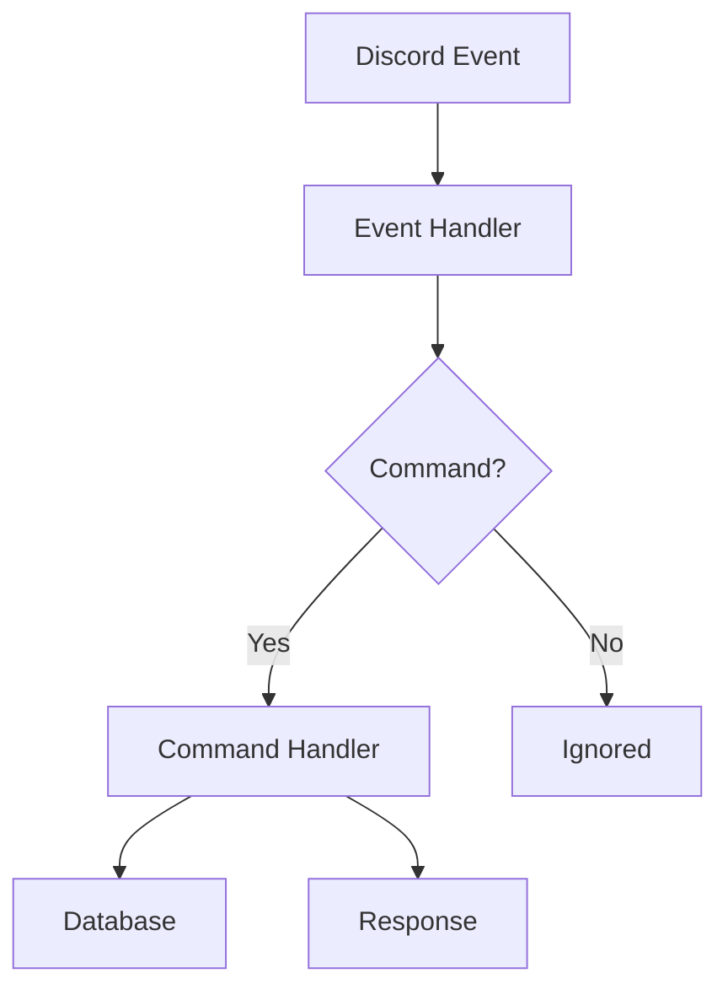

# Pattern: Beautiful README

A README is the front door. Most READMEs are text dumps. This pattern describes how to build one that communicates clearly, looks deliberate, and makes a project feel real.

---

## What Makes a README Beautiful

**Not this:**
- A wall of bullets
- Vague one-line description
- Missing quick start
- Installation steps that don't actually work
- No visual hierarchy

**This:**
- A centered hero with title, tagline, and badges
- One sentence that answers "what is this and who is it for"
- A real quick start with copy-paste commands that work
- Sections that flow from "what is it" → "how do I run it" → "how does it work" → "how do I contribute"
- Visual rhythm: prose, code, table, callout — not just bullets all the way down

---

## GitHub Markdown Capabilities

GitHub renders a wider set of HTML and Markdown features than most people use.

### Centered Hero Section
```html
<div align="center">

  <h1>Project Name</h1>
  <p>One-sentence tagline that tells someone why they should care.</p>

  <!-- Badges -->
  
  

</div>
```

### Badges (shields.io)
Always put badges at the top, center-aligned, grouped by category:

```markdown
<!-- Status -->


<!-- Versions -->


```

### GitHub Callout Blocks
Use these for important information. GitHub renders them with colored borders.

```markdown
> [!NOTE]
> Useful information that users should know, even when skimming content.

> [!TIP]
> Helpful advice for doing things better or more easily.

> [!IMPORTANT]
> Key information users need to know to achieve their goal.

> [!WARNING]
> Urgent info that needs immediate user attention to avoid problems.

> [!CAUTION]
> Advises about risks or negative outcomes of certain actions.
```

### Collapsible Sections
Use `<details>` for long config examples, changelogs, or anything that clutters the main flow:

```html
<details>
<summary>Full environment variable reference</summary>

| Variable | Default | Description |
|---|---|---|
| `BOT_TOKEN` | required | Discord bot token |
| `PREFIX` | `!` | Command prefix |

</details>
```

### Mermaid Diagrams
GitHub natively renders Mermaid diagrams. Use for architecture, flows, and decision trees.

````markdown

````

### Tables
Use tables for config reference, feature comparison, or anything with structured columns. Keep them compact.

```markdown
| Feature | Status | Notes |
|---|---|---|
| Slash commands | ✅ | All guilds |
| Economy system | ✅ | SQLite-backed |
| Music | 🚧 | In progress |
```

### Aligned Feature Grids
For showcasing features, a two-column layout reads better than a bullet list:

```markdown
| | |
|---|---|
| 🎮 **Economy system** | Currency, leaderboards, shop items |
| 🎵 **Music playback** | YouTube, Spotify, queue management |
| 🛡️ **Moderation** | Warn, mute, ban with audit logging |
| 📊 **Analytics** | Per-guild usage stats |
```

---

## Standard README Structure

For a bot or service project, use this order:

```
1. Hero (title, tagline, badges)
2. Overview (2–4 sentences: what, for whom, why it exists)
3. Just Ask an Agent (lazy reader shortcut — always include)
4. Features (table or grid, not a bullet list)
5. Quick Start — Let an Agent Do It (if installation is involved)
6. Manual Setup (for people who want control)
7. Configuration (table of env vars or config keys)
8. Architecture (mermaid diagram or brief prose, not both)
9. Development (run locally, test, lint)
10. Deployment (real commands, not conceptual steps)
11. Contributing
12. License
```

Not every project needs all twelve. Cut what doesn't apply. Never add a section just to fill space.

---

## The Lazy Reader Section (Required on Every README)

Every Mad House README includes a "Just Ask an Agent" section near the top — after the overview, before features. This is a hard standard.

The principle: not everyone will read the README. Some people just want to understand the thing or get it running. Let them. Give them a one-line instruction to drop the repo into an AI and ask it whatever they want.

```markdown
## Don't Feel Like Reading?

Drop this repo into any AI assistant — Claude, ChatGPT, Copilot, whatever you use — and ask it to explain the project, walk you through setup, or answer any question you have. Everything it needs to understand this repo is already here.
```

That's the whole section. Keep it short. Don't pitch the AI or be cute about it. Just give them the shortcut and move on.

**Placement rules:**
- Always after the overview paragraph
- Before Features
- Under a heading like `## Don't Feel Like Reading?` or `## Just Ask an Agent`
- Never longer than 3 sentences

---

## The Agent Install Prompt Section (Required When Setup Is Involved)

Any README that involves installation, configuration, or running a service must include a **copy-paste agent prompt** that a reader can drop directly into their AI assistant to have it handle the whole setup.

This is section 5 in the structure: **Quick Start — Let an Agent Do It**. It comes before the manual setup steps.

The prompt must:
- Tell the agent what the project is
- Give the repo URL
- List exactly what the agent should do, in numbered steps
- State the reader's environment (OS, tools already installed)
- End with "Walk me through each step one at a time"

**Template:**

````markdown
## Quickest Setup — Let an Agent Do It

Copy this into [Claude](https://claude.ai), [ChatGPT](https://chat.openai.com), or any AI assistant. It'll handle the whole setup — you just answer its questions.

```text
I want to set up [PROJECT NAME].
The repo is at https://github.com/OWNER/REPO

Please help me:
1. Clone the repo
2. [Step specific to this project]
3. [Step specific to this project]
4. Verify it's working

I'm on [environment — e.g., Ubuntu 22.04 VPS with Docker installed].
Walk me through each step one at a time.
```

The whole process takes under [N] minutes.
````

**Rules:**
- The code block language tag is always `text` — never bare or `bash`. This ensures AI assistants don't try to execute it as code.
- Steps must be real and accurate — read the repo before writing them
- Include the environment so the agent doesn't guess
- The prompt lives in a `text` code block so it copies cleanly
- Keep the time estimate honest — don't write "5 minutes" if it takes 30

---

## Writing Rules

- **First sentence: no fluff.** "A Discord bot" not "Welcome to the exciting world of..."
- **Every heading answers a question.** "Quick Start" answers "How do I run this?"
- **Code blocks always have a language.** ` ```bash `, not ` ``` `
- **Commands must actually work.** If a command fails on a fresh clone, fix it before pushing.
- **No "TODO: fill this in"** sections. If you don't know what goes there, leave the section out.
- **One thing per sentence.** Break compound sentences.
- **Avoid passive voice.** "Run this command" not "This command can be run."

---

## Anti-Patterns

| Anti-pattern | Why it's bad | Fix |
|---|---|---|
| Bullet lists for everything | No visual rhythm, exhausting to read | Mix with prose, tables, callouts |
| Generic tagline | "A powerful Discord bot" says nothing | Be specific: "A moderation + economy bot for small gaming communities" |
| Missing quick start | Forces reader to reverse-engineer setup | Add it. Always. |
| Outdated commands | Destroys trust | Run commands before committing |
| README longer than needed | Nobody reads past 1000 lines | Use `<details>` or link to docs |
| All H2 headings | Flat hierarchy, no scanability | Use H2 for major sections, H3 for subsections |

---

## README Quality Checklist

Before committing a README, check:

- [ ] Does the first sentence tell me what this project is?
- [ ] Are badges accurate and pointing to the right repo?
- [ ] Does Quick Start work on a fresh clone (tested)?
- [ ] Is there at least one non-bullet visual element (table, diagram, callout)?
- [ ] Does the heading structure make logical sense when skimmed?
- [ ] Are all code blocks language-tagged?
- [ ] Is the license correct and current?
- [ ] Does it read well on mobile (GitHub mobile preview)?

---

## Examples Reference

Good open-source README patterns to study:
- `sindresorhus/awesome` — clean minimal structure
- `discordjs/discord.js` — code-heavy project done right
- `nicedoc.io` pattern — centered hero with feature grid

---

## For Agents

When asked to write or improve a README, always:

1. Read the existing README first (if one exists)
2. Read the project source or docs to understand what it actually does
3. Apply the structure above — do not just rearrange existing content
4. Write the "Overview" section from scratch based on actual behavior, not the old tagline
5. Verify that Quick Start commands match current scripts and config
6. Use at least one callout block, one table, and proper badge syntax
7. Do not pad. If a section has nothing real to say, omit it.
